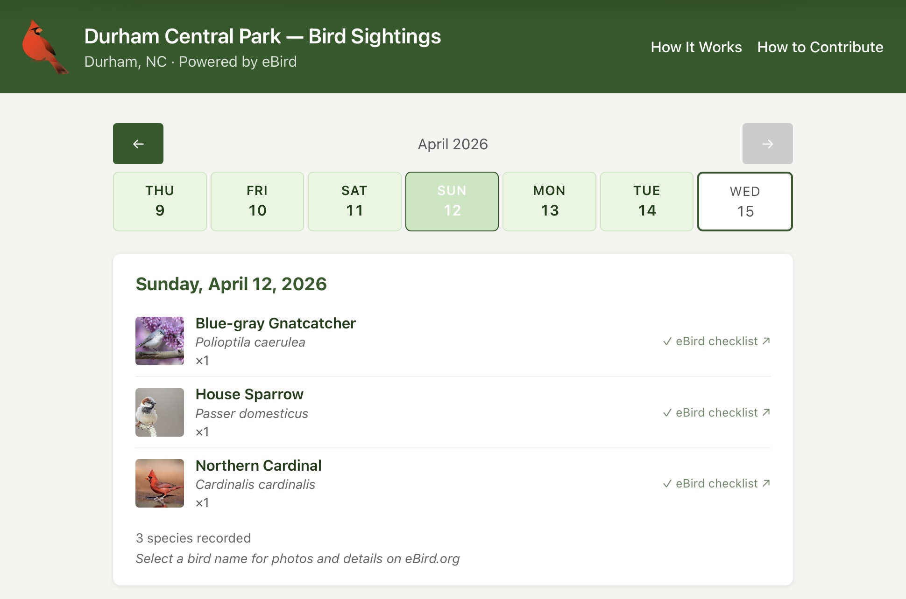

# local-birds

A bird sighting tracker for Durham Central Park, NC — powered by the
[eBird API](https://ebird.org) and running entirely on Cloudflare's free tier.

**Live:** https://birds.burns.sh



## What it does

Polls eBird every hour for recent bird observations within 2 km of Durham
Central Park. Displays a rolling week view with per-day sighting lists,
species thumbnails from the Macaulay Library, and highlights for rare/notable
species.

No server to manage. No Docker. No tunnel. Everything runs on Cloudflare's
free tier (100k req/day, 5 GB D1, Cron Triggers included).

## Stack

| Layer | Choice |
|---|---|
| Runtime | Cloudflare Workers (TypeScript) |
| Router | [Hono](https://hono.dev) |
| Database | Cloudflare D1 (managed SQLite) |
| Scheduler | Cloudflare Cron Triggers (hourly) |
| Frontend | Server-rendered HTML + [htmx](https://htmx.org) |
| Templating | Hono JSX |
| Static assets | Workers Assets |

## Local development

### Prerequisites

- Node.js 18+
- A [Cloudflare account](https://dash.cloudflare.com/sign-up) (free)
- An [eBird API key](https://ebird.org/api/keygen)

### Setup

```bash
git clone https://github.com/bbbburns/local-birds
cd local-birds
npm install

# Create the D1 database (copy the database_id into wrangler.toml)
npx wrangler d1 create birds

# Apply the schema locally
npx wrangler d1 migrations apply birds --local

# Create .dev.vars with your secrets
cat > .dev.vars <<EOF
EBIRD_API_KEY=your_key_here
POLL_SECRET=anything
EOF

# Start the dev server
npx wrangler dev
```

Visit `http://localhost:8787`. Trigger a manual poll to seed data:

```bash
curl -X POST http://localhost:8787/admin/poll \
  -H "Authorization: Bearer anything"
```

### Tests

```bash
npm test
```

Three test suites run inside the Workers runtime via
`@cloudflare/vitest-pool-workers`:

- `test/calendarUtil.test.ts` — pure date arithmetic
- `test/db.test.ts` — D1 query wrappers
- `test/routes.test.ts` — HTTP integration via `SELF`

## Deployment

**First-time setup:**
```bash
# Set production secrets (one-time)
npx wrangler secret put EBIRD_API_KEY
npx wrangler secret put POLL_SECRET

# Apply schema to production D1 (one-time)
npx wrangler d1 migrations apply birds --remote
```

**Ongoing deploys:** push to `main` — Cloudflare's CI/CD pipeline builds and
deploys automatically.

**When a new migration is added:** run `npx wrangler d1 migrations apply birds --remote`
manually before or after pushing, since the build pipeline does not run migrations.

The cron trigger (`0 * * * *`) is configured in `wrangler.toml` and activates
automatically after deploy. Trigger a manual poll in production:

```bash
curl -X POST https://your-worker.workers.dev/admin/poll \
  -H "Authorization: Bearer <POLL_SECRET>"
```

## Data notices

Bird observation data is provided by [eBird](https://ebird.org), a citizen
science program of the
[Cornell Lab of Ornithology](https://www.birds.cornell.edu). Species thumbnails
are served from the
[Macaulay Library](https://www.macaulaylibrary.org). This project's MIT license
covers the source code only — data and images remain subject to Cornell's terms
of use.

## License

[MIT](LICENSE)
