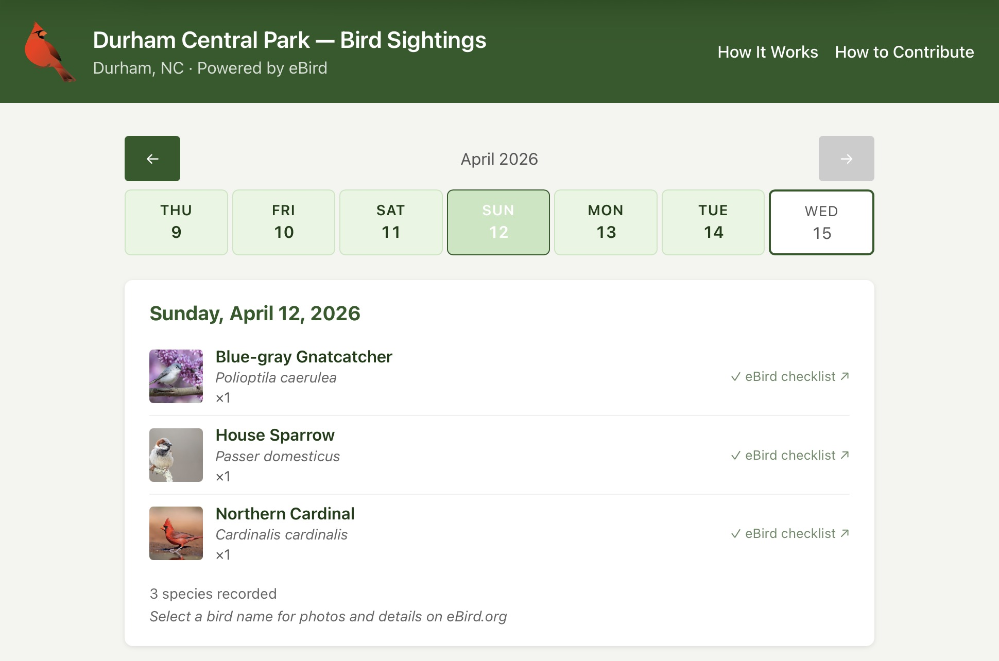
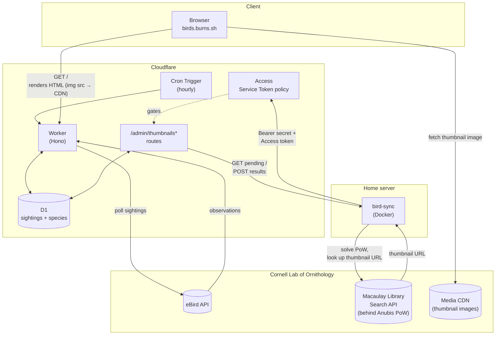

# local-birds

A bird sighting tracker for Durham Central Park, NC — powered by the
[eBird API](https://ebird.org) and running entirely on Cloudflare's free tier.

**Live:** https://birds.burns.sh



## What it does

Polls eBird every hour for recent bird observations within 2 km of Durham
Central Park. Displays a rolling week view with per-day sighting lists,
species thumbnails from the Macaulay Library, highlights for rare/notable
species, and observer notes pulled from eBird checklist comments.

No server to manage for sightings, polling, or the site itself — everything
runs on Cloudflare's free tier (100k req/day, 5 GB D1, Cron Triggers
included). Species thumbnails are the one exception: Macaulay Library's
thumbnail search API sits behind a bot-check that blocks Cloudflare Workers,
so a small Docker service (`bird-sync/`) running on a home server fetches
those and pushes them back — see [bird-sync](#bird-sync-thumbnail-fetcher)
below. Everything else stays fully serverless.

## Architecture


```mermaid
flowchart TB
    subgraph client["Client"]
        browser["Browser<br/>birds.burns.sh"]
    end

    subgraph cf["Cloudflare"]
        cron["Cron Trigger<br/>(hourly)"]
        worker["Worker<br/>(Hono)"]
        d1[("D1<br/>sightings + species")]
        access["Access<br/>Service Token policy"]
        admin["/admin/thumbnails*<br/>routes"]
        cron --> worker
        worker <--> d1
        access -.gates.-> admin
        admin <--> d1
    end

    subgraph home["Home server"]
        birdsync["bird-sync<br/>(Docker)"]
    end

    subgraph cornell["Cornell Lab of Ornithology"]
        ebird[("eBird API")]
        search[("Macaulay Library<br/>Search API<br/>(behind Anubis PoW)")]
        cdn[("Media CDN<br/>(thumbnail images)")]
    end

    client ~~~ cf
    cf ~~~ cornell

    browser -- "GET /<br/>renders HTML (img src → CDN)" --> worker
    browser -- "fetch thumbnail image" --> cdn

    worker -- poll sightings --> ebird
    ebird -- observations --> worker

    birdsync -- "solve PoW,<br/>look up thumbnail URL" --> search
    search -- thumbnail URL --> birdsync
    birdsync -- "Bearer secret +<br/>Access token" --> access
    admin -- "GET pending /<br/>POST results" --> birdsync
```

`eBird`, the Macaulay Library search API, and the media CDN are grouped under
`Cornell Lab of Ornithology` since all three are that org's services.

Sightings are fully serverless end to end: an hourly Cron Trigger polls
eBird, writes to D1, and the Worker renders the site straight from there.
Thumbnails are a two-step handoff: `bird-sync` (behind Anubis PoW) only
*looks up* the thumbnail URL from Macaulay's search API and pushes that URL
into D1 — it never touches image bytes. The Worker renders that URL into
``, and it's the **browser** that fetches the actual image, directly
from Cornell's media CDN (a different, non-PoW-gated host), bypassing both
the Worker and `bird-sync` entirely.

## Stack

| Layer | Choice |
|---|---|
| Runtime | Cloudflare Workers (TypeScript) |
| Router | [Hono](https://hono.dev) |
| Database | Cloudflare D1 (managed SQLite) |
| Scheduler | Cloudflare Cron Triggers (hourly) |
| Frontend | Server-rendered HTML + [htmx](https://htmx.org) |
| Templating | Hono JSX |
| Static assets | Workers Assets |

## Local development

### Prerequisites

- Node.js 18+
- A [Cloudflare account](https://dash.cloudflare.com/sign-up) (free)
- An [eBird API key](https://ebird.org/api/keygen)

### Setup

```bash
git clone https://github.com/bbbburns/local-birds
cd local-birds
npm install

# Create the D1 database (copy the database_id into wrangler.toml)
npx wrangler d1 create birds

# Apply the schema locally
npx wrangler d1 migrations apply birds --local

# Create .dev.vars with your secrets
cat > .dev.vars <<EOF
EBIRD_API_KEY=your_key_here
POLL_SECRET=anything
THUMBNAIL_PUSH_SECRET=anything
EOF

# Start the dev server
npx wrangler dev
```

Visit `http://localhost:8787`. Trigger a manual poll to seed data:

```bash
curl -X POST http://localhost:8787/admin/poll \
  -H "Authorization: Bearer anything"
```

### Tests

```bash
npm test
```

Test suites run inside the Workers runtime via
`@cloudflare/vitest-pool-workers`:

- `test/calendarUtil.test.ts` — pure date arithmetic
- `test/db.test.ts` — D1 query wrappers
- `test/routes.test.ts` — HTTP integration via `SELF`
- `test/poller.test.ts` — eBird/Macaulay poller logic

## Deployment

**First-time setup:**
```bash
# Set production secrets (one-time)
npx wrangler secret put EBIRD_API_KEY
npx wrangler secret put POLL_SECRET
npx wrangler secret put THUMBNAIL_PUSH_SECRET   # generate with: openssl rand -hex 32

# Apply schema to production D1 (one-time)
npx wrangler d1 migrations apply birds --remote
```

**Ongoing deploys:** push to `main` — Cloudflare's CI/CD pipeline builds and
deploys automatically.

**When a new migration is added:** run `npx wrangler d1 migrations apply birds --remote`
manually before or after pushing, since the build pipeline does not run migrations.

The cron trigger (`0 * * * *`) is configured in `wrangler.toml` and activates
automatically after deploy. Trigger a manual poll in production:

```bash
curl -X POST https://your-worker.workers.dev/admin/poll \
  -H "Authorization: Bearer <POLL_SECRET>"
```

## bird-sync (thumbnail fetcher)

`bird-sync/` is a small standalone Docker service — not part of the Worker,
not deployed by Cloudflare. It's meant to run on a home server (or anywhere
with a stable outbound connection) and handles the one piece that can't run
on Workers: Macaulay Library's thumbnail search API sits behind a
client-side proof-of-work bot-check that blocks Cloudflare's `fetch()`.
`bird-sync` solves that challenge itself, fetches thumbnail URLs for
pending species, and pushes them to the Worker over two authenticated
routes (`GET /admin/thumbnails/pending`, `POST /admin/thumbnails`).

```bash
cd bird-sync
cp .env.local.example .env.local   # for testing against `wrangler dev`
cp .env.prod.example .env.prod     # for the real deployment

just build
just start       # local: talks to wrangler dev on localhost
just start-prod  # prod: talks to the deployed Worker
just poll          # force an immediate poll cycle, no restart needed
just logs
just stop
```

See the `## bird-sync` section in `CLAUDE.md` for the full design rationale
(the Anubis bot-check, how auth works end-to-end, the docker-compose
networking split between local/prod) and operational detail.

## Data notices

Bird observation data is provided by [eBird](https://ebird.org), a citizen
science program of the
[Cornell Lab of Ornithology](https://www.birds.cornell.edu). Species thumbnails
are served from the
[Macaulay Library](https://www.macaulaylibrary.org). This project's MIT license
covers the source code only — data and images remain subject to Cornell's terms
of use.

## License

[MIT](LICENSE)
